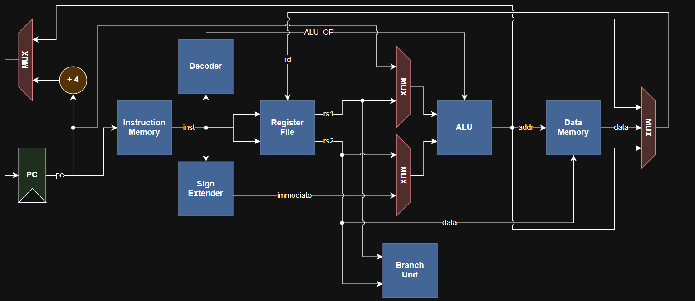
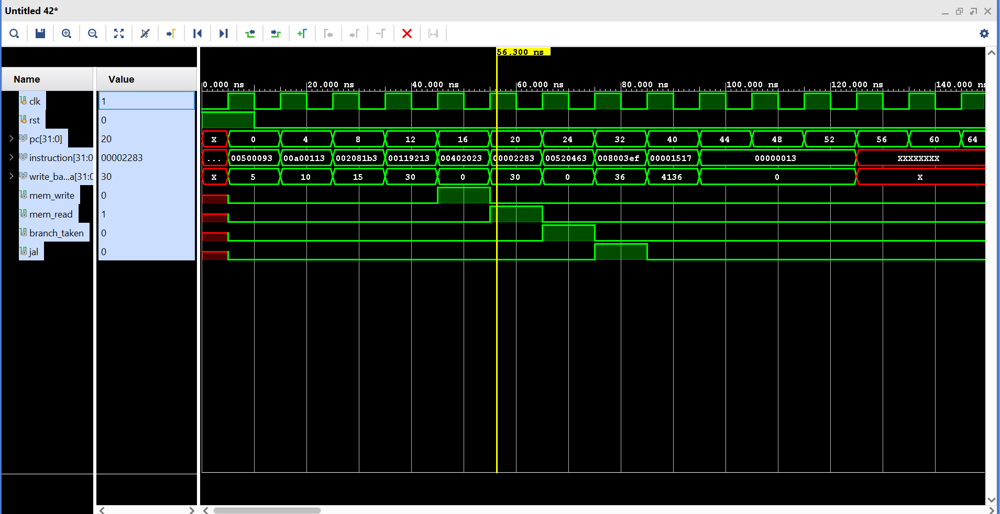

# RV32I Single-Cycle RISC-V Processor in Verilog

A modular RV32I-inspired single-cycle RISC-V CPU implemented in Verilog HDL and simulated using Xilinx Vivado.
This project was built to strengthen understanding of computer architecture, datapath/control design, instruction execution flow, and RTL-based processor implementation.

---

## Features

- Modular RTL design
- RV32I-style instruction support
- Single-cycle datapath architecture
- Separate instruction and data memory
- Register file with write-back support
- ALU with arithmetic, logical, comparison, and shift operations
- Branch and jump handling
- External instruction loading using `$readmemh`
- Fully simulated and verified in Vivado

---

## Supported Instructions

### Arithmetic & Logical (R-Type)
| Instruction | Description |
|---|---|
| ADD | Register addition |
| SUB | Register subtraction |
| AND | Bitwise AND |
| OR | Bitwise OR |
| XOR | Bitwise XOR |
| SLT | Set Less Than |
| SLL | Shift Left Logical |
| SRL | Shift Right Logical |
| SRA | Shift Right Arithmetic |

### Immediate (I-Type)
| Instruction | Description |
|---|---|
| ADDI | Add Immediate |
| SLTI | Set Less Than Immediate |
| SLLI | Shift Left Logical Immediate |
| SRLI | Shift Right Logical Immediate |
| SRAI | Shift Right Arithmetic Immediate |

### Memory
| Instruction | Description |
|---|---|
| LW | Load Word |
| SW | Store Word |

### Branch
| Instruction | Description |
|---|---|
| BEQ | Branch if Equal |
| BNE | Branch if Not Equal |
| BLT | Branch if Less Than |
| BGE | Branch if Greater or Equal |

### Jump
| Instruction | Description |
|---|---|
| JAL | Jump and Link |
| JALR | Jump and Link Register |

### Upper Immediate
| Instruction | Description |
|---|---|
| LUI | Load Upper Immediate |
| AUIPC | Add Upper Immediate to PC |

---

## Architecture Overview

The processor follows a modular single-cycle datapath architecture consisting of:

- Program Counter (PC)
- Instruction Memory
- Instruction Decoder
- Control Unit
- Register File
- ALU
- Data Memory
- Immediate Generator
- Branch/Jump Control Logic
- Writeback Path

---

## Datapath Diagram



---

## Simulation Showcase

The waveform below demonstrates sequential instruction execution, arithmetic and shift operations, memory read/write, branch and jump handling, write-back behavior, and PC update logic.



---

## Example Program Execution

The processor executes externally loaded machine-code programs using:

```verilog
$readmemh("program.mem", memory);
```

Example instructions executed during simulation:

```assembly
addi  x1, x0, 5
addi  x2, x0, 10
add   x3, x1, x2
slli  x4, x3, 1
sw    x4, 0(x0)
lw    x5, 0(x0)
beq   x4, x5, label
jal   x7, target
auipc x10, 1
```

---

## Project Structure
RV32I_CPU/
│
├── rtl/
│   ├── alu.v
│   ├── control_unit.v
│   ├── cpu_top.v
│   ├── instruction_decoder.v
│   ├── instruction_memory.v
│   ├── data_memory.v
│   ├── register_file.v
│   └── pc.v
│
├── tb/
│   └── cpu_top_tb.v
│
├── programs/
│   └── program.mem
│
├── docs/
│   ├── datapath.png
│   └── waveform.png
│
└── README.md

---

## Tools Used

- Verilog HDL
- Xilinx Vivado
- Vivado Simulator

---

## Future Improvements

- Pipelined architecture
- Hazard detection and forwarding
- Instruction cache and data cache
- UART integration
- FPGA deployment
- RISC-V assembler integration

---

## Learning Outcomes

This project helped strengthen understanding of CPU datapath design, control signal generation, RISC-V instruction formats, branch and jump execution flow, memory interfacing, RTL design methodology, and simulation and verification workflows.

---

